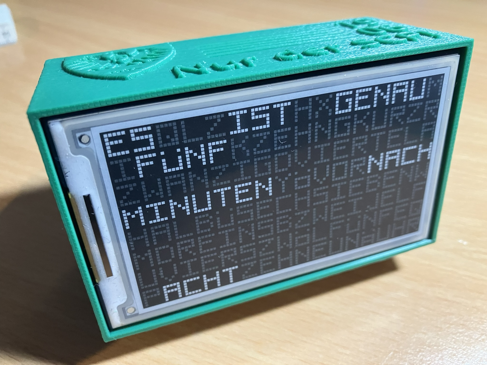
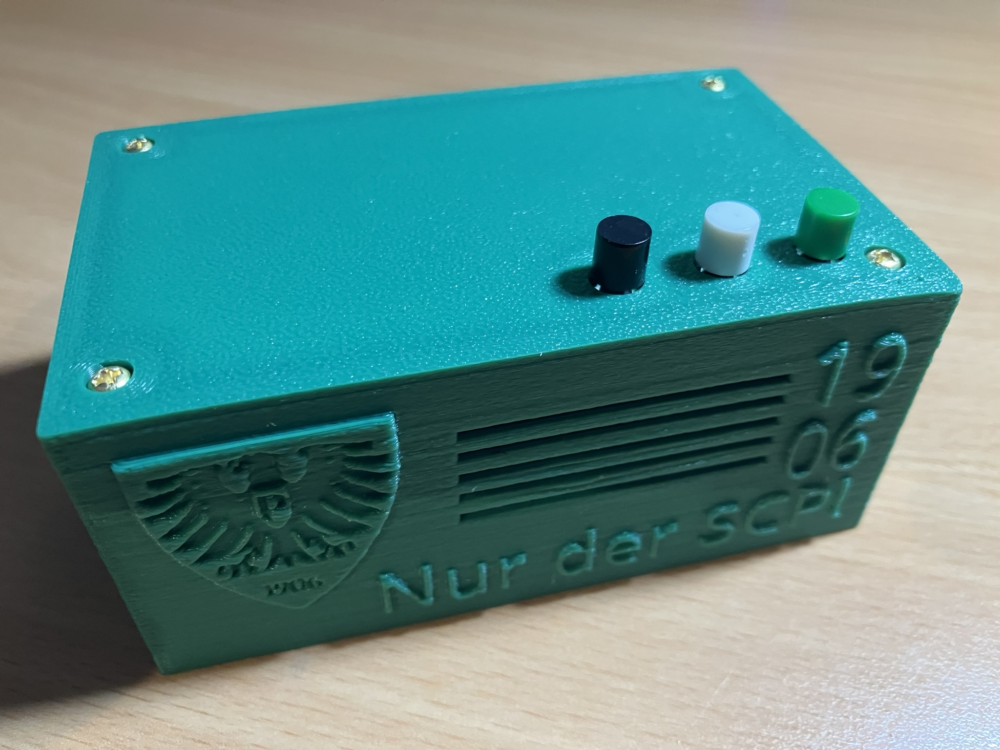
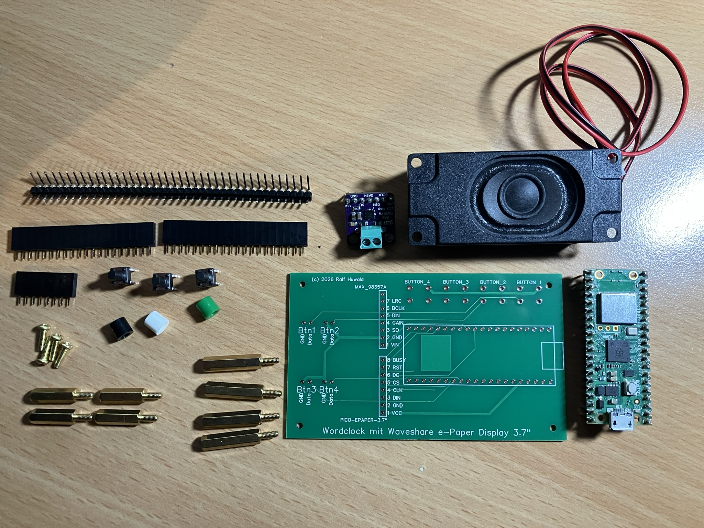

# Wordclock Pro

Wordclock auf Basis eines  Raspberry Pi Pico mit Waveshare e-paper 3.7" Display und MAX 98357A Mono Verstärker. Die Workclock zeigt minütlich die aktuelle Zeit in deutscher Sprache auf dem 3.7" e-paper display an. Z.B. "ES IST FÜNF MINUTEN NACH VIER".

<div>

</div>

Es gibt einen Hell- und Dunkel-Modus, der im Code von wordclock.py festgelegt werden kann:

```python
# Night_Mode ist Weisse Schrift auf schwarzem Grund (z.B. für nachts)
Night_Mode_Hours = False
# Night_Mode_Hours = True
# Night_Mode_Hours = (18,19,20,21,22,23,0,1,2,3,4,5)
```

Die Uhr wird zweimal am Tag mit einer RTC synchronisiert: Um 02:00 Uhr und im 03:00 (wegen Sommerzeit-Problem)...

- [Benötigte Hardware](#Hardware)
- [Installation](#installation)
- [Links](#Links)

Die 4 Taster haben folgende Funktion:

- Taster 1 sagt die aktuelle Uhrzeit an
- Taster 2 spielt einen der vorhandenen SCP-Fan-Gesänge
- Taster 3 wird für den Reset der WLAN-Verbindung benötigt (5x innerhalb von 2 Sekunden drücken löscht die WLDN- und API Key Config)
- Taster 4 wird im Programm aktuell nicht abgefragt und kann für eigene Zwecke verwendet werden

## Hardware
* Raspberry Pi Pico, Pico " oder Pimoroni Pico Plus 2W (mit mehr RAM/Flash für längere Sounds)
* Waveshare e-paper display 3.7", 480 x 280 pixel
* Lautsprecher 3 Watt, 8 Ohm
* MAX 98357A Mono Verstärker
* Buchsenleiste 2 x 20 Pin, 1 x 8 Pin
* Stiftleiste gewinkelt 1 x 8 Pin
* 3 - 4 Kurzhubtaster (etwa 6x6x9mm) optimalerweise mit Kappen in Vereinsfarben (schwarz, weiss, grün)
* 4 Schrauben 2.5mm
* 4 Abstandhalter 2.5mm, etwa 30mm lang
* Platine (Muster siehe bei Dateien)
* 5V Stromquelle
* Lötkolben

## Installation
1. Pino, Buchsenleisten, Stiftleiste und Kurzhubtaster auf die Platine löten (Kurzhubtaster auf die Rückseite!)
2. Gehäuse mit 3D-Drucker ausdrucken
3. Platine mittels der Abstandhalter und Schrauben an das e-paper Display anschrauben
4. Platine einbauen
5. API key von **Free Time Zone Database & API** beschaffen
6. Alle Dateien auf den Pico kopieren (z.B. mit [Thonny](https://thonny.org/)).
7. Start wordclock.py (z.B. mit Thonny)
8. Die Wordclock benötigt eine WLAN-Verbindung und einen API Key für die Zeit-Synchronisierung. Die Konfiguration wird in der Datei wordclock.conf abgespeichert. Kann keine WLAN-Verbindung bzw. keine Uhrzeit ermittelt werden, startet automatisch ein WLAN-Hotspot *WORDCLOCK*. Dort kann die Konfiguration (SSID, Kennwort, API Key) eingegeben werden.
9. Damit die Wordclock automatisch startet, muss die Datei wordclock.py auf dem Pico umbenannt werden in main.py

## Links
* [Raspberry Pi Pico-series](https://www.raspberrypi.com/documentation/microcontrollers/pico-series.html)
* [Pimoroni Pico Plus 2 W](https://shop.pimoroni.com/products/pimoroni-pico-plus-2-w?variant=42182811942995)
* [Waveshare 3.7" e-paper display](https://www.waveshare.com/pico-epaper-3.7.htm)
* [Free Time Zone Database & API](https://www.timezonedb.com/)
